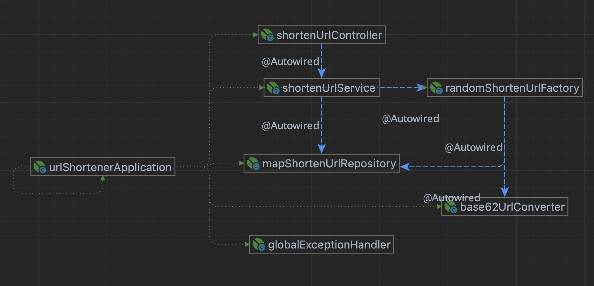

# url-shortener


# **221126 변경사항**



## Sequence라는 상태값에 의존하지 않는 Random키구현 방식으로 변경

1. 기존 index를 기준으로 하는 경우 무상태성을 보장하지 못하여 ScaleOut이 어려워지고, 불필요한 db조회가 발생할수있어 Random한 형태로 변경

2. shortenUrl 도메인객체의 키값정책에 따라 키를 생성하여 객체를 생성하는 ShortenUrlFactory를 인터페이스화하여 확장

   ShortenUrlFactory : class -> Interface

   SequenceShortenUrlFactory : 기존 ShortenUrlFactory

   RandomShortenUrlFactory : 랜덤값 기준으로 URL생성하는 Factory구현

   

## 예외처리 개선

1. 의미를 구체화한 UncheckedException 확장 (NotExistingUrlException)
2. 전역예외처리핸들러 구현


## 테스트코드 작성 및 개선

1. 단위테스트를 위한 Mocking사용

2. MockMvc를 이용한 Controller 테스트

### 	해결했던부분

   - **MockMvc UTF-8인코딩문제**  
     - 원인 : spring에서는 자동으로 utf-8인코딩을 하지만, mockMvc는지원하지 않아 한글예외메시지를 올바로 표시해주지 않음.
     
     - 해결 
     
       - MockMvcBuilder를 통해 filter로 utf-8인코딩되도록 변경
     
       - mockMvc가 자동주입되므로 주입된 이후에 초기화를 위하여 빈생성주기를 고려하여 @PostConstruct를 이용하여 초기화 콜백

   ``` java
       @PostConstruct
       void init() {
           mockMvc = MockMvcBuilders.webAppContextSetup(webApplicationContext)
                   .addFilter(new CharacterEncodingFilter("UTF-8", true))
                   .build();
       }
   ```

   - **MockMvc 로 요청확인시 ResponseBody에 null값이 뜨는 문제**
     - 원인 : mock stubbing시에 dto를 만들어 값을 반환하도록 하였으나, mockMvc는 String으로 만든 값을 기준으로 하기때문에 동등비교를 위한 equals가 정의되어있어야함.
     - 해결 : ShortenUrlCreatRequestDto에 equals를 구현함으로써 해결.

   ``` 
   java.lang.AssertionError: Response content expected:<{"shortenUrl":"/aewiopfj"}> but was:<{"shortenUrl":null}>
   Expected :{"shortenUrl":"/aewiopfj"}
   Actual   :{"shortenUrl":null}
   ```


## 패키지 및 네이밍 가독성을 위한 변경

 	1. 클래스가 늘어남에 따라 캡슐화를 위해서 package-private로 되어있던 클래스들을 public으로 변경후 view를 담당할 presentation, 비즈니스로직을 담당할 application, domain을 담당할 domain, db접근을 위한 infrastructure로 나눔
     - **생각해본점**
       - 가독성 vs 캡슐화

         - 한 프로젝트에 여러 service가 존재한다면, public으로 해두었을 시 각 aggregate간 캡슐화가 떨어지지 않을까?

         - aop적용하려면 프록시를 만들기 위해 어쩔수 없이 public으로 만들어야 하지 않을까

         - 하위패키지까지 포함하는 접근제어자가 있으면 좋겠다.

2. Url 도메인객체의 이름을 shortenUrl로 변경
   - shortenUrl을 위한 도메인객체로 좀더 명확한 이름 사용 url은 URI와 같은 기타 라이브러리와 겹칠가능성있음. 
3. UrlShorteningService의 이름을 shortenUrlService로 통일성 있게 변경


-------

# **221102 변경사항**


## index가 계속 노출되고 ConverterWithBase64와 강한 의존관계를 발생시키는 구조 변경

1. Url 도메인객체 필드에 shortenUrl 추가 : index에 의존적이지 않도록 상태를 유지하도록 변경
2. UrlFactory로 객체생성하도록 변경
   - Factory에서 인코딩할 Sequence값과 인코딩을 책임지고 더이상 Index를 활용하지 않게 캡슐화함
3. 정적클래스였던 ConverterWithBase62 를 전략패턴으로 변경하고 UrlFactory로 의존성주입
   - interface로 UrlConverter를 두고, 구현체로 Base62UrlConverter 로 변경하여 결합도를 낮춤.
   - 추후 Base62가 아닌 다른 인코딩방식도 유연하게 대응되도록 변경
4. ConverterWithBase62에 지속적으로 의존하던 UrlShorteningServce 의 getUrl() 메서드가 사라짐.
   - Url객체를 UrlFactory로 생성하면 객체가 shortenUrl 상태값을 들고있기 때문에 더이상 Converter를 사용하지 않음.
5. UrlRepository에서 save는 더이상 Index를 참조하지 않고 shortenUrl을 조회할 수 있도록 변경.
6. UrlRepository에서 findById 삭제(db를 통한 인덱싱이 이루어지지 않기 때문에 해당 서비스에서 있을 이유 없다고 판단)
7. UrlAccessCountDto에서 전달하던 index 삭제(캡슐화개념 없이 클라이언트에게 모든정보를 친절히 보여주는 것이 좋을거라고 막연히 판단했던 부분 시정)


## DTO의 변환위치 Controller vs Service 중 Service로 채택

1. 'POST /urls' 요청시  UrlIn dto내부의 url이 아니라 dto자체를 Service객체로 넘김.

   - Controller 가 임의로 작성된 String을 넘기면 service객체의 의도대로 사용할 수 없음.
   - Controller는 캡슐화된 dto를 조작할 수 없게됨. 

2. 'GET /urls/{shortenUrl}' 요청시 서비스객체는 UrlAccessCountOut dto를 반환하여 Controller에서 받음.

   - Url 도메인객체에서의 컨버팅은 UrlAccessCountOut dto에 from이라는 변환메서드를 생성하여 변환책임 부여.

     (dto양식이 변하더라도 변한 객체 내애서 수정하면 됨.)

   - 캡슐화된 dto자체를 service객체에서 반환

     (불필요한 domain필드값을 Controller에 넘기지 않으며, Controller는 임의적으로 dto를 수정 변경할 수 없음.)

3. dto의 형태가 변화한다면, service에서 dto의 변환을 담당하기 때문에 dto에 의존적일수밖에 없을것같음.


## Post로 Url 정보를 받을때 Controller 유효성 검사 추가

1. spring-boot-starter-validation 을 이용하여 dto를 받을시에 url인지 아닌지 파악하는 검증로직 추가 

   - @URL 어노테이션은 scheme여부만 가지고 url인지 아닌지 판단하고 끝남 scheme이 없어도 url인지 찾아낼수있도록 개선 필요

     **※ 해결과제 :** 검증시 url이 아닌경우 계속 500에러를 뱉어내고있음. 400에러가 기본적용된다는데 억지로 HttpClientErrorException을 던져도 json응답에서는 500에러를 던짐 확인이 필요함.


## Base62UrlConverter 코드 가독성 증대

``` java
//변경전
BASE62_TABLE[(int) (quotient % 62)] ;
  
//변경후
int digitIndex = (int) (quotient % 62); 
char digit = BASE62_TABLE[digitIndex];
```

1. index의 값의 의미가 무엇인지 나타도록 분리하여 digitIndex(자릿수 내에 표현될수있는 값의 Index)으로 나타내고 테이블에 대입
2. Long -> String String-> Long 타입으로 인코딩과 디코딩 하는 역할이라 좀더 의미적으로 가독성있게 작성을 못하는중


## ArrayList 저장공간에서 Map 저장공간으로 변경

1. UrlRepository를 implements하여 MapUrlRepository를 생성

2. Map Url 레포지토리를 작성하기만 하면 다른코드의 변동없이 작성되길 기대했으나, Interface의 설계문제로 Interface수정 및 Service수정이 이루어짐(OCP 위반)

   -> Interface 내 findAll 반환타입을 Optional<List\<Url>>에서 List\<Url>로 변경 어차피 인스턴스화가 되어있는데, null로 나갈 확률이 없고 없으면 없는대로 전달해도 의미상 문제가 없음.

3. Interface개선후 Map 구현은 상당히 빠른 구현이 가능했음(대략 10분도 안걸림). 역할과 구현을 분리한 장점을 느낄 수 있었음. 단, 좋은 Interface설계가 전제되어야함을 파악함.


## 주요 어플리케이션 Layer class 접근제어자를 package-private로 변경

1. Controller는 public, Service와 Repository는 package-private로 캡슐화(생각해보니 그러면 test는 ..? 어떻게?... 되네? 뭐지.. 왜 되는거지; )

2. Domain객체인 Url은 dto 객체의 변환메서드에 의존함에 따라 public으로 둘 수 밖에 없음(dto와 domain의 패키지가 다름)

   

## 해결이 필요한 과제

1. Test가 Base62UrlConverter 외에 전무함. 테스트코드 작성을 잘 할줄 알아야함.
2. 테스트전략이나 프레임워크와 함께 공존하는 테스트를 다룰줄 몰라서 한계가 있음. 테스트관련 공부가 필요
